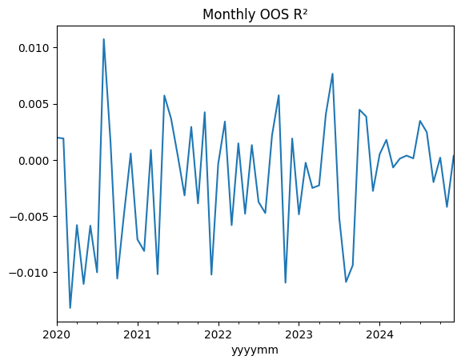
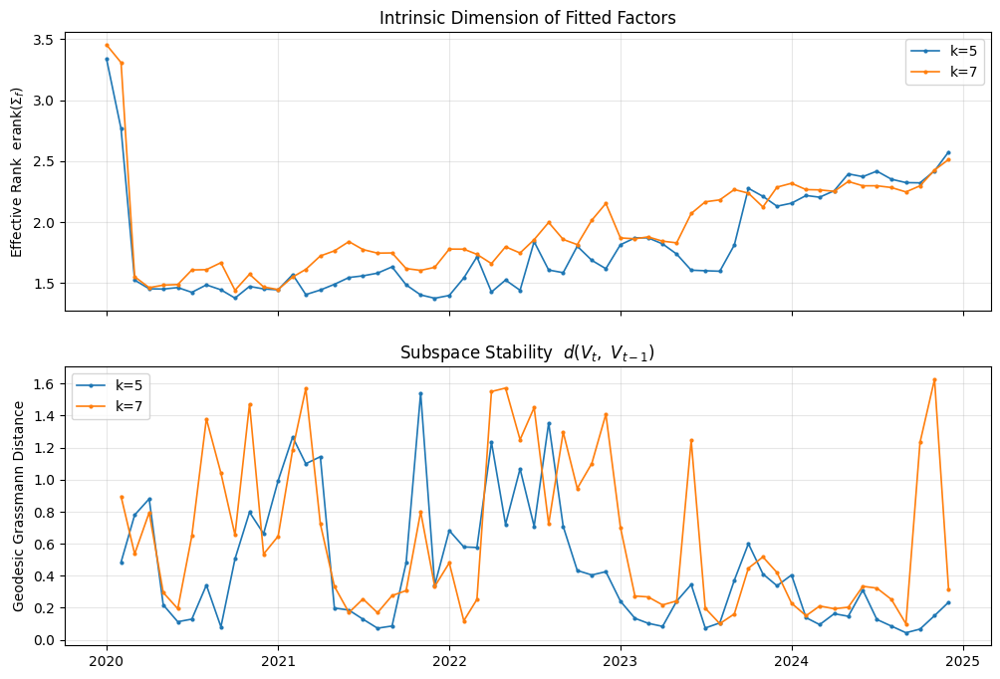

# expermint_ppp Results

- Source notebook: `/Users/apple/Desktop/Academics/Research_work/TheVirtueOfComplexity_PaperReplication_Experimentation-master/notebooks/expermint_ppp.ipynb`
- Notebook last modified: `2026-03-16 13:48:24 UTC`
- Report generated: `2026-03-16 23:59:51 UTC`
- Notebook cells: `19`
- Plot outputs extracted: `2`

## Key Metrics
- Overall OOS R^2 (1): `-0.0023`

## Plots
### 1. Monthly OOS R^2
Cell: `11`

### 2. Intrinsic Dimension and Grassmann Stability
Cell: `13`

## Run Issues
- Cell 13: `NameError` - name 'mdates' is not defined
